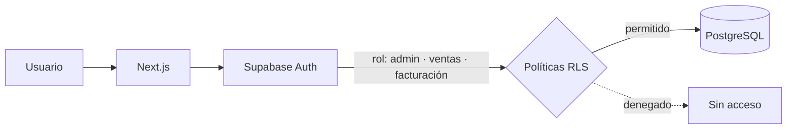

# Arabsa Industrial — Plataforma B2B de cotizaciones

**Plataforma SaaS que reemplaza las cotizaciones manuales por teléfono y WhatsApp para una empresa de venta industrial.**
 
*B2B SaaS that replaces manual phone/WhatsApp quoting for an industrial sales company.*

<!-- Agrega aquí una captura del dashboard (guárdala en /docs):

-->

---

## El problema · The problem

Las cotizaciones se hacían a mano, por teléfono y WhatsApp: lentas, difíciles de rastrear y sin control de crédito ni facturación. La plataforma centraliza todo el proceso de venta en un solo sistema.

> *Quotes were handled manually by phone and WhatsApp. The platform centralizes the whole sales flow in one system.*

## Funcionalidades · Features

- **Roles con permisos** (Admin, Ventas, Facturación), con control de acceso **a nivel de base de datos** mediante Row Level Security.
- **Cotizaciones B2B** de principio a fin.
- **Módulo de crédito y facturación** con cálculo automático de vencimientos.
- **Catálogos PDF dinámicos** generados desde el sistema.
- **Panel de métricas en tiempo real** para la dirección.

## Seguridad · Security

Cada rol solo puede leer y modificar lo que le corresponde, y esa regla vive **en la base de datos** (políticas RLS de PostgreSQL), no solo en la interfaz. Aunque alguien manipule el frontend, no puede ver datos de otro rol.

## Stack

| Capa | Tecnología |
|---|---|
| Frontend | Next.js 16 · TypeScript · Tailwind CSS |
| Backend / Datos | Supabase (PostgreSQL, Auth, Row Level Security) |
| CI/CD | GitHub Actions |
| Despliegue | Vercel |

## Capturas · Screenshots

<!-- Agrega capturas en /docs (oculta datos reales del cliente) y descomenta:
| Cotizaciones | Crédito y facturación | Métricas |
|---|---|---|
|  |  |  |
-->

## Código · Source code

El código es **privado por acuerdo con el cliente**. Puedo mostrar una demostración en vivo en entrevista.
 *Source code is private under client agreement — live walkthrough available on request.*

---

Desarrollado por **[Alfonso Méndez](https://github.com/meyern01)** · **[Kodiak](https://getkodiak.dev)**

